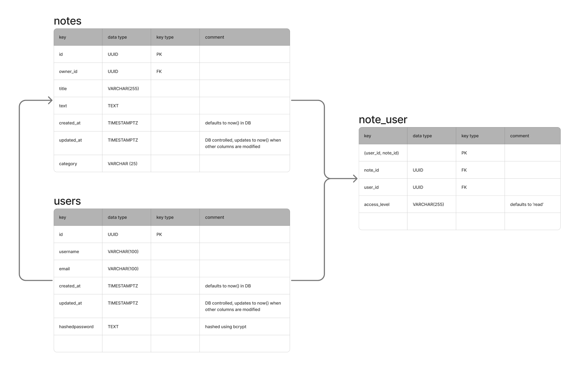

# SwingNotes-Nodejs-Express
A secure and structured backend API built with Node.js, Express, PostgreSQL, and JWT-based authentication. This project supports user registration, login, and note-taking features with role-based access for admin functionalities.

# Installation 
1. Clone the repository

2. Install dependencies:
``npm i``
3. Create "logs" folder in project root if it does not exist
``mkdir logs``
4. Set up neccessary .env variables, copy the .env.example and rename it .env
    - set up connection with database (e.g. Neon)
    - set a generated secret key
5. (If needed, run the SQL commands provided in ``/docs/setUpPSQL.md`` to set up the basic DB structure in e.g. Neon or pgAdmin (requires alternative db.ts setup) )

# Running the App (Dev Mode)

``npm run dev``

This runs the app with ts-node-dev

# About
This is a stand-alone backend project that allows the storage of personal notes that can only be accessed via verified login to a user account.

## 🚀 Features
* User authentication with JWT
* Password hashing using bcrypt
* CRUD operations for personal notes
* Share notes with other users (read or edit access)
* Role-based access control (user, admin)
* Optional note categories and title search
* Swagger API documentation
* Structured error handling and logging middleware

## 🧰 Tech Stack
* Node.js + Express
* PostgreSQL
* JWT for authentication
* bcrypt for password security
* TypeScript
* Swagger for API docs
* ESLint + Prettier for code quality

## 🔐 Security
- Passwords are hashed using *bcrypt* before being stored in the DB
- JWT tokens are securely generated and verified using a server-side secret
- Protected and admin-only endpoints are guarded using ``verifyJWT`` and ``authorizeAdmin`` middleware
- parameterized queries are used to prevent SQL injection

## 🔋 Performance
- JWT payloads include user metadata (``id``, ``username``, ``role``, etc.) to reduce redundant DB calls
- where applicable: SELECT * is avoided and the fetches limited to neccessary data

## 👤 Users 
- DB generated uuid
- Database sets role to ``"user"`` by default 
- Used role can be updated to ``"admin"`` or ``"user"`` by an existing admin
- Timestamps ``created_at``and ``updated_at`` are handled by DB

## 📝 Notes
All notes can only be accessed by their owner (a verified user)
- Notes are stored with UUID, generated by DB
- Optional ``category`` field
- Timestamps ``created_at``and ``updated_at`` are handled by DB
- Notes can be searched by title

## 🔗 Note Sharing
- Notes can be shared with other users, giving them either:
- *Read access* (can view)
- *Edit access* (can modify)
- Only the *owner* can delete a note or change its sharing settings

## 👥 Access Levels
Each user has one of the following access levels per note:
- owner: Full control
- edit: Can read and update the note
- read: Can only view the note

# Endpoints 
All endpoints except /signup and /login require JWT-authentication

## 🌍 Public
| Method | Route  | Description          |
|--------|--------|----------------------|
| POST   | /signup | Create user account  |
| POST   | /login  | Login and get JWT    |

## 📝 Notes (for authenticated users)
| Method | Route                         | Description               |
|--------|-------------------------------|---------------------------|
| GET    | /notes                        | Get all notes             |
| POST   | /notes                        | Create a new note         |
| GET    | /notes/:id                    | Get one note by ID        |
| PUT    | /notes/:id                    | Update a note             |
| DELETE | /notes/:id                    | Delete a note             |
| GET    | /notes/search?q=term          | Search notes by title     |
| GET    | /notes/categories             | Get all used categories   |
| GET    | /notes/categories/:category   | Get notes by category     |
| GET    | /notes/:id/access-list        | Get a list of users with access to a note
| POST   | /notes/:id/share              | Share a note with another user
| DELETE | /notes/:id/share              | Revoke all sharing access to a note

## 🧑‍💼 Admin Endpoints (requires admin role)
| Method | Route                         | Description               |
|--------|-------------------------------|---------------------------|
| GET    | /admin/users                  | Get total user count and user list |
| PATCH  | /admin/users/:id              | Update user role (user ↔ admin) |

# Data diagram

# 📚 Swagger Docs
Visit: http://localhost:3000/api-docs to explore the API with Swagger UI.

# ✍️ Development Notes
API logs incoming requests via custom requestLogger middleware.

Centralized error handling with consistent error responses.

Designed with modular, reusable code (controllers, routes, middleware).

verifyJWT middleware enriches req.user for role-based logic.

# ✅ Todos / Future Improvements
- [ ] Add pagination and filtering for large note lists
- [ ] Improve error feedback for client apps

# 🧑‍💻 Author
Rebecca Lindman
Made with ❤️ as part of a full-stack learning journey.
